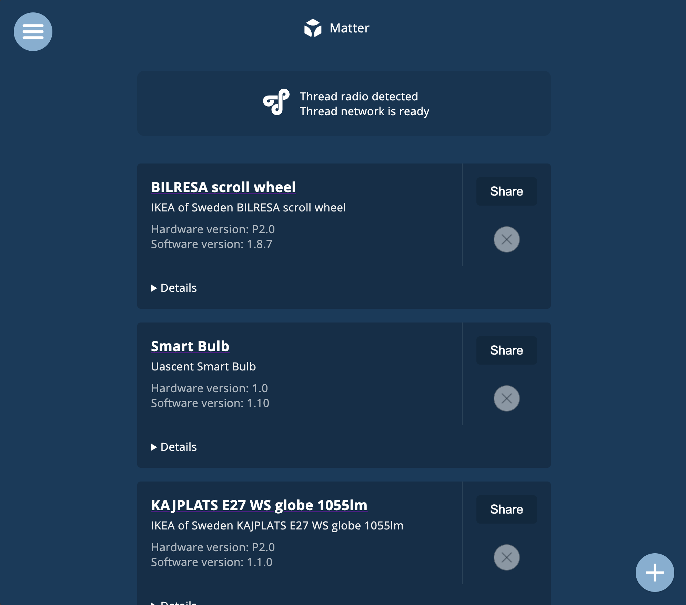
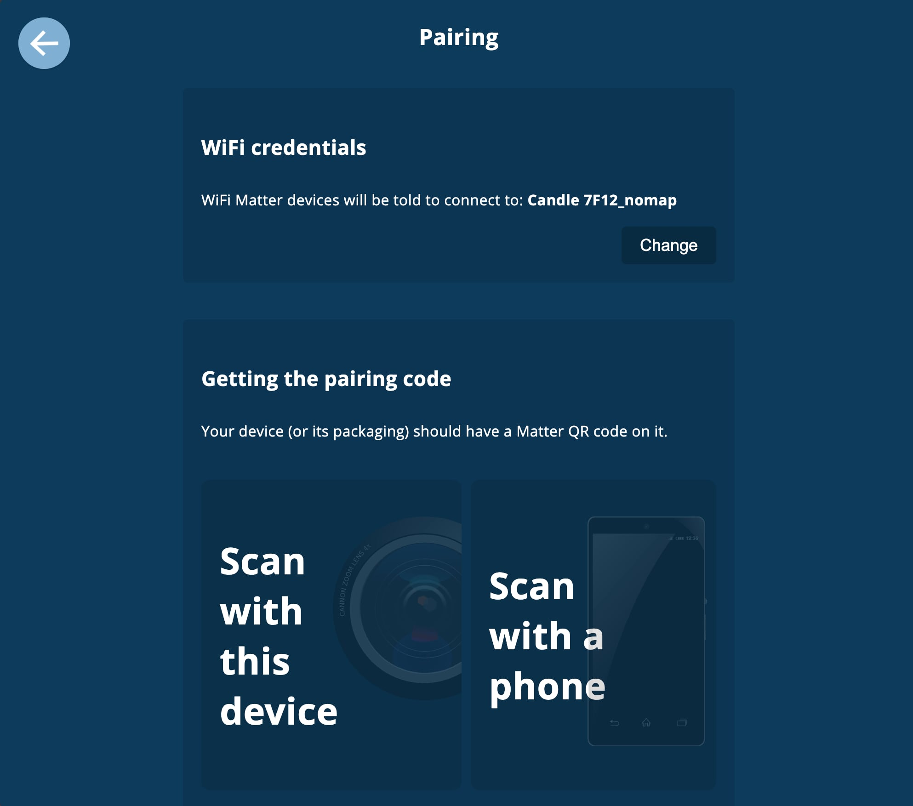

# Matter adapter

An addon for the Candle smart home controller that adds support for Matter devices. The goal is to figure out how difficult it is to make Matter privacy friendly.

### Supported devices
Most common devices should work, although not all attributes have been tested in practice.

### Features
- Has Thread support through a built-in open border router.
- A pre-selected set of attributes is turned into properties, but you can explore the multitipde of attributes that Matter devices have, and turn whichever ones you like into thing properties.
- You can also override property titles and other details so that you can optimally use your Matter devices with voice control.
- Has support for Data Mute functionality, the same privacy protecting feature that the Zigbee2MQTT addon has. This allows you to (temporarily) block incoming data from devices whenever you want. For example, to not collect motion sensor data during the day.

### Ensuring optimal security and privacy protection
- To get optimal privacy protection you should use Candle 3.0, since it's Hotspot feature works seamlessly with this addon to create an isolated Matter network.
- Similarly, you should not merge the Candle Thread network with those of other (commercial) devices you own (such as an Apple Homepod). That would punch a hole in the privacy protection, alling the Thread devices to bypass the Candle Controller if they try to access the internet. In other words: connect all your Thread Matter devices to and through Candle, and not through any other apps or border-router devices in your home.

### Limitations
There are currently some limitations:
- Only runs on the 64 bit version of Candle (2.0.2 onwards).

### FAQ
- What is a vendor ID? It's an officially assigned number. Example: https://github.com/home-assistant/core/issues/84454

### More

Based on the Python Matter Server project by Home Assistant:
https://github.com/home-assistant-libs/python-matter-server

Builds on the Open Thread Border Router:
https://github.com/openthread/ot-br-posix

It has been tested with the Home Assistant USB stick, but you should be able to use other Thread radios just fine.
https://community.home-assistant.io/t/home-assistant-skyconnect-usb-stick-announced-will-be-compatible-with-both-zigbee-and-thread-including-matter-chip-over-thread/433594/

More about Candle:
https://www.candlesmarthome.com
