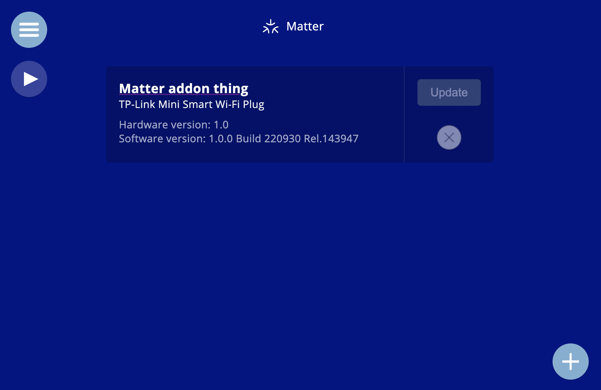
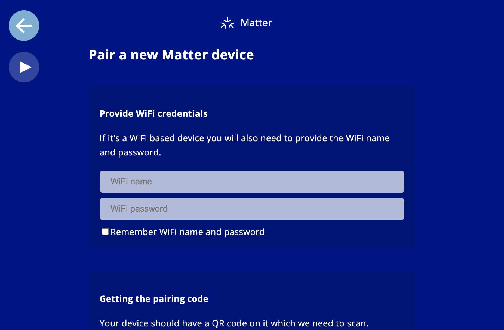

# Matter adapter

An addon for the Candle smart home controller that adds support for Matter devices. The goal is to figure out how difficult it is to make Matter privacy friendly.

### Supported devices
It has been tested with the TP Link P125M Mini power plug. There is theoretical (untested) support for other devices such as:
- motion/occupancy sensors
- temperature and humidity sensors
- colored and normal lightbulbs

### Features
- Has support for Data Mute functionality, the same privacy protecting feature that the Zigbee2MQTT addon has. This allows you to (temporarily) block incoming data from devices whenever you want. For example, to not collect motion sensor data during the day.

### Limitations
There are currently some limitations:
- Does not support every possible device type yet. Mostly because these devices don't exist yet, making it hard to test.
- Only runs on the 64 bit version of Candle (2.0.2 onwards).
- Currently does not yet run an Openthread border router, although that is on the wishlist.

### More

Based on the Python Matter Server project by Home Assistant:
https://github.com/home-assistant-libs/python-matter-server

It will probably be optimized for use with the Home Assistant USB stick too.
https://community.home-assistant.io/t/home-assistant-skyconnect-usb-stick-announced-will-be-compatible-with-both-zigbee-and-thread-including-matter-chip-over-thread/433594/

More about Candle:
https://www.candlesmarthome.com
